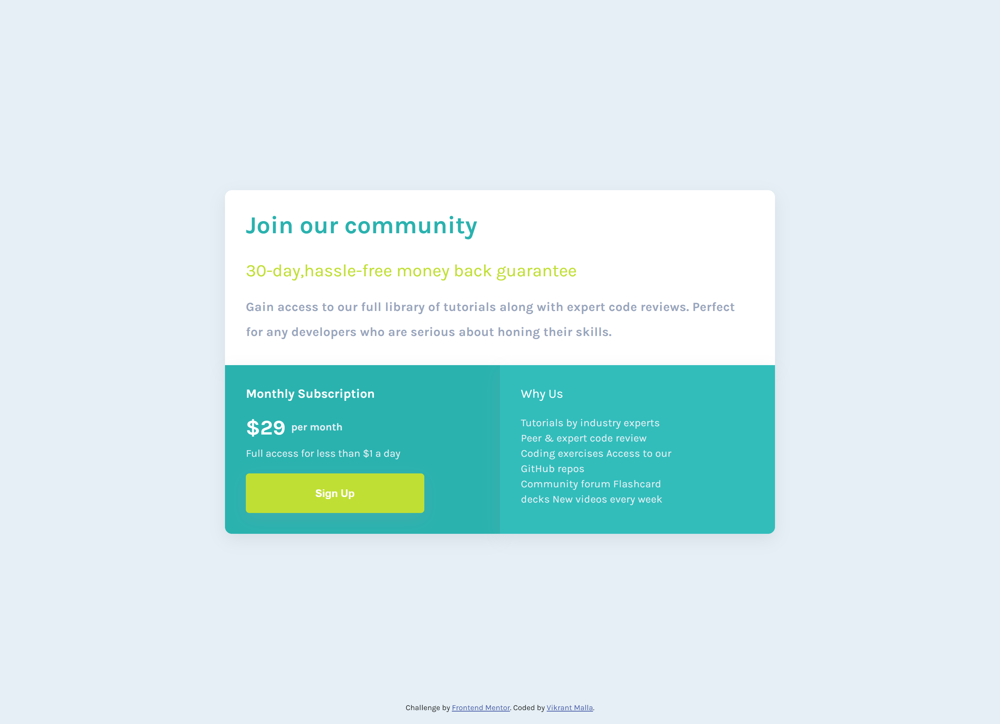

# Frontend Mentor - Single price grid component solution

[Frontend Mentor](https://www.frontendmentor.io) challenges help you improve your coding skills by building realistic projects.

## Table of contents

- [Overview](#overview)
  - [The challenge](#the-challenge)
  - [Screenshot](#screenshot)
  - [Links](#links)
- [My process](#my-process)
  - [Built with](#built-with)
- [Author](#author)

## Overview

## The challenge

- View the optimal layout for the component depending on their device's screen size
- See a hover state on desktop for the Sign Up call-to-action

### Screenshot

### Links

- Solution URL: [Add solution URL here](https://www.frontendmentor.io/profile/vikrantmalla)

### Built with

- Semantic HTML5 markup
- CSS custom properties
- Flexbox
- Media Queries
- Mobile-first workflow

## Author

- GitHub - [Vikrant Malla](https://github.com/vikrantmalla)
- Frontend Mentor - [@vikrantmalla](https://www.frontendmentor.io/profile/vikrantmalla)
